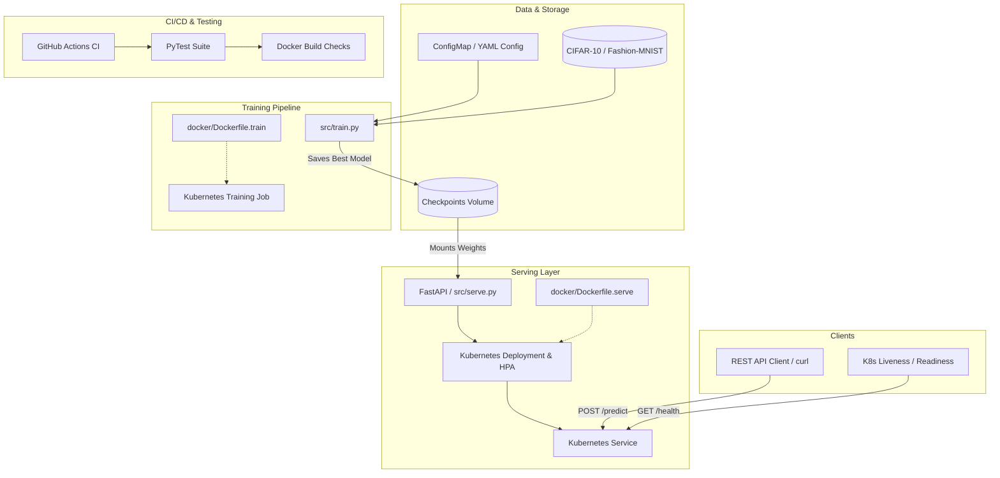

# MLOps PyTorch Pipeline

A production-grade MLOps pipeline for PyTorch image classification workloads covering local development, containerized training and serving with Docker, orchestration with Kubernetes, CI/CD with GitHub Actions, and unit testing.

---

## Architecture Diagram



---

## Project Structure

```text
mlops-pytorch-pipeline/
├── .github/
│   └── workflows/
│       └── ci.yml                 # GitHub Actions CI pipeline
├── .dockerignore                  # Docker build ignore rules
├── .gitignore                     # Git ignore rules
├── README.md                      # Project documentation & runbook
├── pyproject.toml                 # Pytest & project configurations
├── conftest.py                    # Test configuration and path setup
├── configs/
│   └── training_config.yaml       # Hyperparameters & data configuration
├── data/                          # Dataset directory (CIFAR-10)
├── docker/
│   ├── Dockerfile.train           # Multi-stage Dockerfile for training
│   └── Dockerfile.serve           # Hardened, slim Dockerfile for FastAPI serving
├── k8s/
│   ├── namespace.yaml             # Kubernetes namespace definition
│   ├── configmap.yaml             # Training configuration ConfigMap
│   ├── pvc.yaml                   # PersistentVolumeClaims for data & checkpoints
│   ├── training-job.yaml          # Kubernetes Training Job manifest
│   ├── serving-deployment.yaml    # Kubernetes Model Serving Deployment
│   ├── serving-service.yaml       # ClusterIP Service for Model Serving
│   └── hpa.yaml                   # Horizontal Pod Autoscaler manifest
├── requirements/
│   ├── train.txt                  # Training dependencies (pinned versions)
│   └── serve.txt                  # Serving runtime dependencies
├── src/
│   ├── __init__.py
│   ├── dataset.py                 # Dataset loading, augmentations & streaming
│   ├── model.py                   # PyTorch models (ResNet-18, SimpleCNN, MLP)
│   ├── train.py                   # Training loop with early stopping & JSON logging
│   └── serve.py                   # FastAPI prediction and healthcheck server
└── tests/
    ├── test_dataset.py            # Dataset loader and transform tests
    ├── test_model.py              # Model architecture & forward pass tests
    ├── test_serve.py              # Health and prediction endpoint tests
    └── test_train.py              # Training loop, evaluation & checkpoint tests
```

---

## Prerequisites

- **Python**: 3.10+
- **Docker**: Docker Desktop or Docker Engine
- **Kubernetes**: `kubectl` with a local or cloud cluster (Minikube, kind, or cloud K8s)

---

## Quick Start (Local Setup)

### 1. Environment Setup

```bash
# Create virtual environment
python3 -m venv .venv

# Activate virtual environment
source .venv/bin/activate

# Install dependencies
python3 -m pip install --upgrade pip
python3 -m pip install -r requirements/train.txt
python3 -m pip install -r requirements/serve.txt
python3 -m pip install pytest
```

### 2. Run Unit Tests

```bash
pytest -q
```

### 3. Local Training (Part B)

Train the model locally with the default configuration in `configs/training_config.yaml`:

```bash
python3 src/train.py
```

*Optional CLI overrides:*
```bash
# Run quick training with fewer epochs or custom batch size
python3 src/train.py --epochs 3 --batch-size 128
```

Training features:
- Reads hyperparameters from `configs/training_config.yaml`.
- Logs structured JSON lines per epoch (`train_loss`, `train_accuracy`, `val_loss`, `val_accuracy`).
- Supports early stopping with configurable patience.
- Saves best checkpoint to `checkpoints/classifier_v1.pt`.

### 4. Local Model Serving (Part B)

Start the FastAPI serving app:

```bash
python3 src/serve.py
```

Test endpoints in a separate terminal:

```bash
# 1. Health check (returns 200 OK when model checkpoint is loaded)
curl -i http://localhost:8080/health

# 2. Predict endpoint (send image)
curl -X POST http://localhost:8080/predict \
  -F "image=@test_image.png"
```

Interactive Swagger API docs are available at: `http://localhost:8080/docs`

---

## Docker Containerization (Part C)

### 1. Build Docker Images

```bash
# Build Training Image (Multi-stage build)
docker build -f docker/Dockerfile.train -t mlops-train:v1 .

# Build Serving Image (Slim runtime, non-root user, healthcheck included)
docker build -f docker/Dockerfile.serve -t mlops-serve:v1 .
```

### 2. Run Containerized Training

Run containerized training with mounted host directories for datasets and checkpoints:

```bash
docker run --rm \
  -v $(pwd)/data:/app/data \
  -v $(pwd)/checkpoints:/app/checkpoints \
  mlops-train:v1
```

### 3. Run Containerized Model Serving

Run the containerized FastAPI server with the mounted checkpoint directory:

```bash
docker run --rm -d --name mlops-serving-app -p 8080:8080 \
  -v $(pwd)/checkpoints:/app/checkpoints \
  mlops-serve:v1
```

### 4. Test Container Endpoints

```bash
# Check health
curl -i http://localhost:8080/health

# Send prediction request
curl -X POST http://localhost:8080/predict \
  -F "image=@test_image.png"

# Stop the container
docker stop mlops-serving-app
```

---

## Kubernetes Deployment (Parts D, E, F)

> **Prerequisite**: A running local cluster (Minikube recommended). Verify `kubectl config current-context` points to `minikube` (not a remote/corporate cluster) before proceeding.

### 1. Create Namespace, ConfigMap & Persistent Volume Claims

```bash
kubectl apply -f k8s/namespace.yaml
kubectl apply -f k8s/configmap.yaml
kubectl apply -f k8s/pvc.yaml
```

### 2. Load Local Docker Images into Minikube

Minikube runs its own container runtime, so locally built images must be loaded explicitly:

```bash
minikube image load mlops-train:v1
minikube image load mlops-serve:v1
```

### 3. Run Kubernetes Training Job (Part D)

```bash
# Trigger training Job
kubectl apply -f k8s/training-job.yaml

# Follow training logs
kubectl logs -f job/pytorch-training-job -n ml-training
```

### 4. Deploy Serving Layer & HPA (Part E)

```bash
# Deploy model serving deployment, service, and autoscaler
kubectl apply -f k8s/serving-deployment.yaml
kubectl apply -f k8s/serving-service.yaml
kubectl apply -f k8s/hpa.yaml
```

### 5. End-to-End Validation (Part F)

```bash
# 1. Check pod status
kubectl get pods -n ml-training

# 2. Describe deployment
kubectl describe deployment model-serving -n ml-training

# 3. Port forward serving service
kubectl port-forward svc/model-serving 8080:80 -n ml-training

# 4. In a separate terminal, test health & prediction
curl -i http://localhost:8080/health
curl -X POST http://localhost:8080/predict \
  -F "image=@test_image.png"
```

### 6. (Optional) Visual Dashboard

```bash
minikube dashboard
```
Open the printed URL, switch the namespace dropdown to `ml-training`, then browse **Workloads → Pods/Jobs/Deployments** to inspect status and logs visually.

---

## API Specification

### `GET /health`
- **Description**: Liveness and readiness health probe.
- **Response**: `200 OK` when model is loaded and ready for inference; `503 Service Unavailable` if no checkpoint is loaded.
```json
{
  "status": "healthy",
  "model_loaded": true,
  "model_path": "/app/checkpoints/classifier_v1.pt",
  "architecture": "resnet18",
  "num_classes": 10
}
```

### `POST /predict`
- **Description**: Accept an image file (`multipart/form-data`) and return class probabilities and top prediction.
- **Request**: Form field `image` (JPEG/PNG).
- **Response**: `200 OK`
```json
{
  "status": "success",
  "predicted_class_id": 3,
  "prediction": "cat",
  "confidence": 0.923624,
  "probabilities": [
    {"class_id": 0, "label": "airplane", "probability": 0.00238},
    {"class_id": 1, "label": "automobile", "probability": 0.002795},
    {"class_id": 2, "label": "bird", "probability": 0.000839},
    {"class_id": 3, "label": "cat", "probability": 0.923624},
    {"class_id": 4, "label": "deer", "probability": 0.000685},
    {"class_id": 5, "label": "dog", "probability": 0.02384},
    {"class_id": 6, "label": "frog", "probability": 0.004279},
    {"class_id": 7, "label": "horse", "probability": 0.001676},
    {"class_id": 8, "label": "ship", "probability": 0.037963},
    {"class_id": 9, "label": "truck", "probability": 0.00192}
  ],
  "model_path": "/app/checkpoints/classifier_v1.pt"
}
```